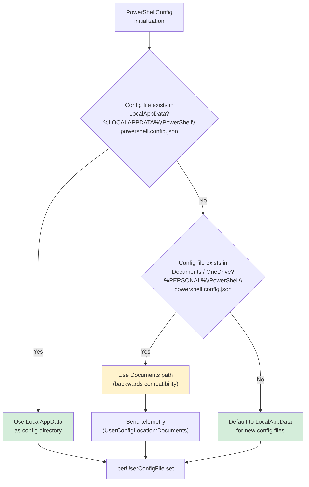
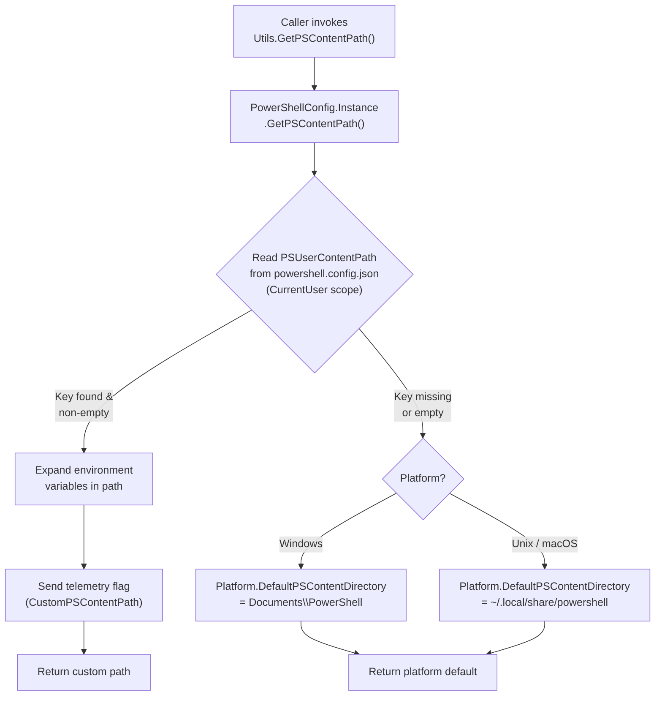
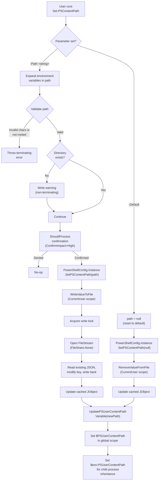
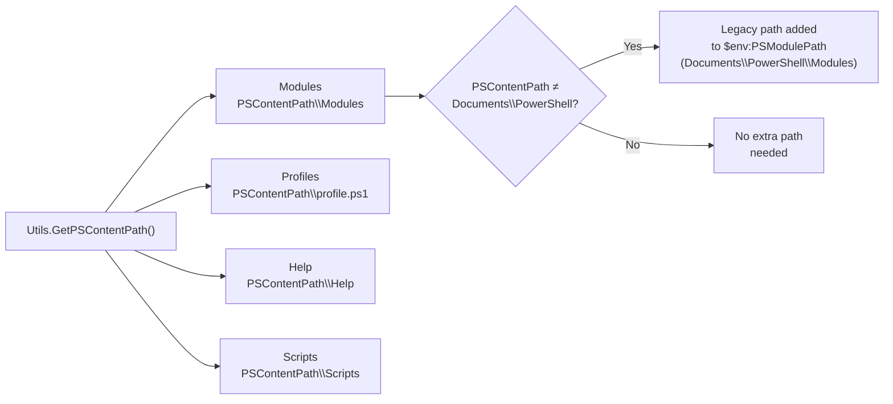
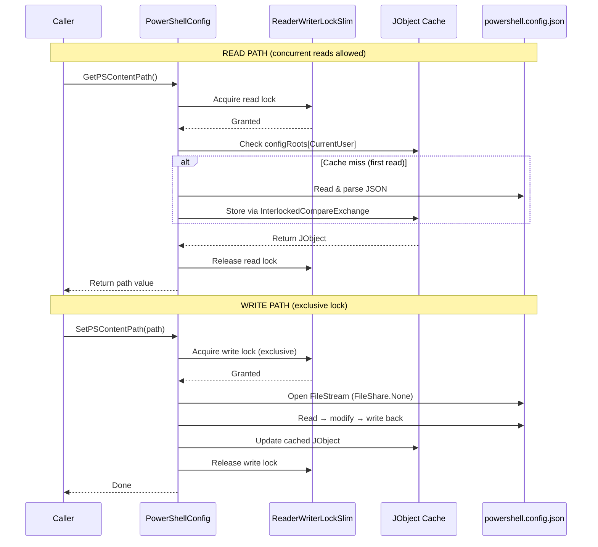

# PSContentPath Resolution & Configuration Flow

## Config File Location — Startup Resolution (Windows)

> **Note:** On Unix/macOS, both locations resolve to the same XDG data directory (`~/.local/share/powershell`), so there is no fallback chain.

## GetPSContentPath — Resolution Flow

## Set-PSContentPath — Configuration Flow

## Consumers — How Paths Derive from PSContentPath

## Config File I/O — Thread Safety

